# Government-sharing-documents
Secure &amp; Share Govt Document with Family Members by html , css , javascript and firebase
# Overview
The Government Document Sharing System is a web-based platform that allows users to securely store, manage, and share their government-issued documents online. Inspired by platforms like DigiLocker, this project leverages modern web technologies to provide a secure and efficient way to handle sensitive documents.

# Features
Secure Document Storage: Upload and store your government documents securely.
Document Sharing: Easily share your documents with authorized entities.
User Authentication: Secure login and registration system using Firebase.
Responsive Design: The platform is fully responsive, ensuring a seamless experience across devices.
Technologies Used
Frontend: HTML, CSS, JavaScript
Backend: Firebase (for authentication and storage)
# Usage
Upload Documents:

Use the upload feature to add government-issued documents to your account.
View Documents:

Access and view your stored documents from the document library.
Share Documents:

Share documents with others by entering their email addresses. Shared documents can be accessed by the recipient securely.
# DEMO
link for website-
https://falak-zehra.github.io/Government-sharing-documents/
Home Pge -
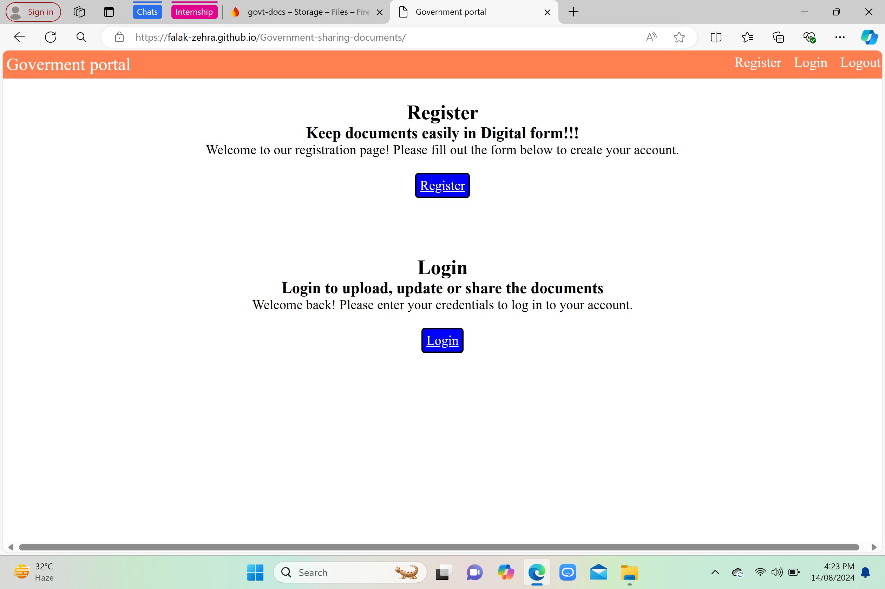
Registration page
-OTP Verification page
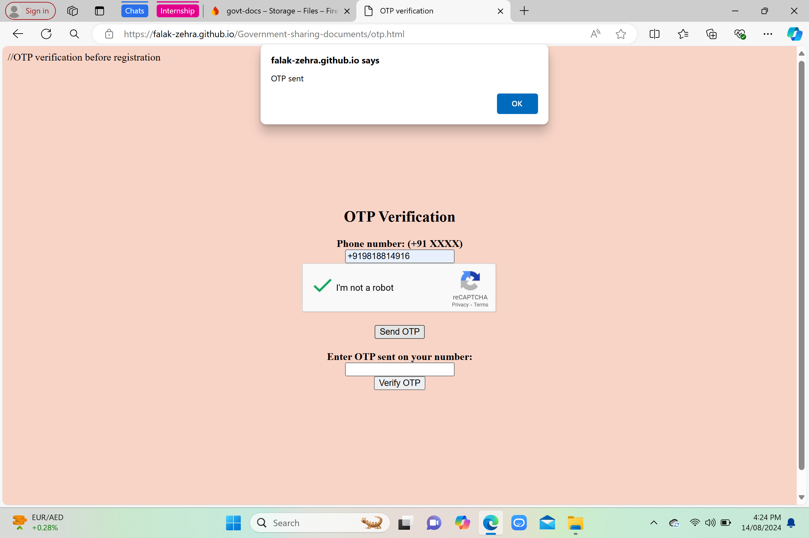
After OTP verification-
SignUP page-
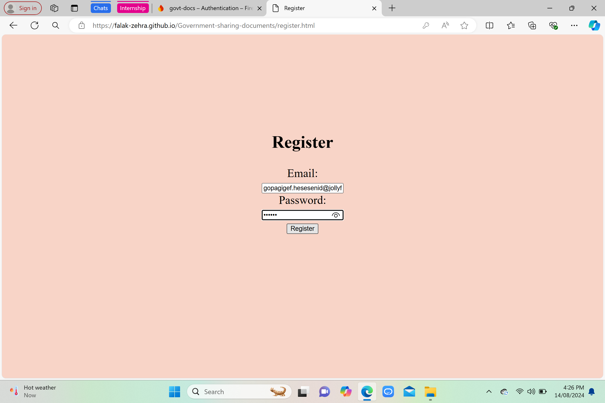
After USER SignUP-
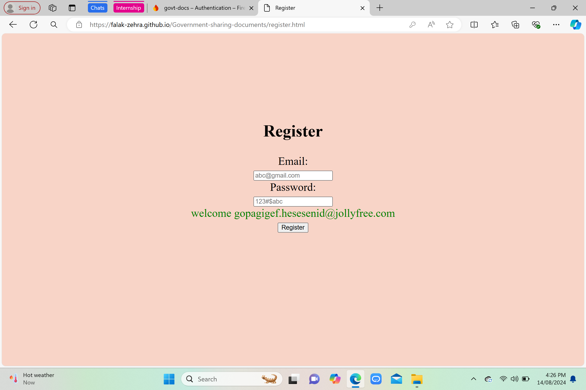
Firebase Authentication-
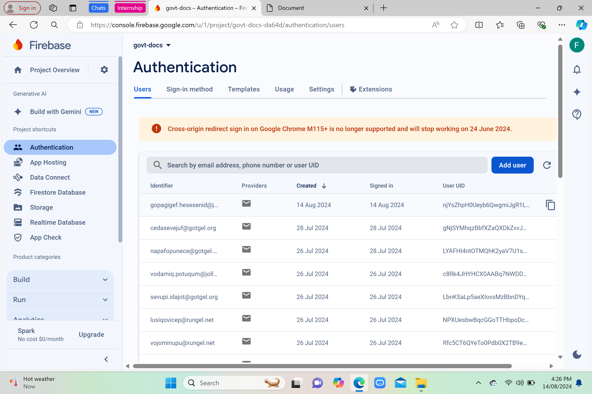
Login page-
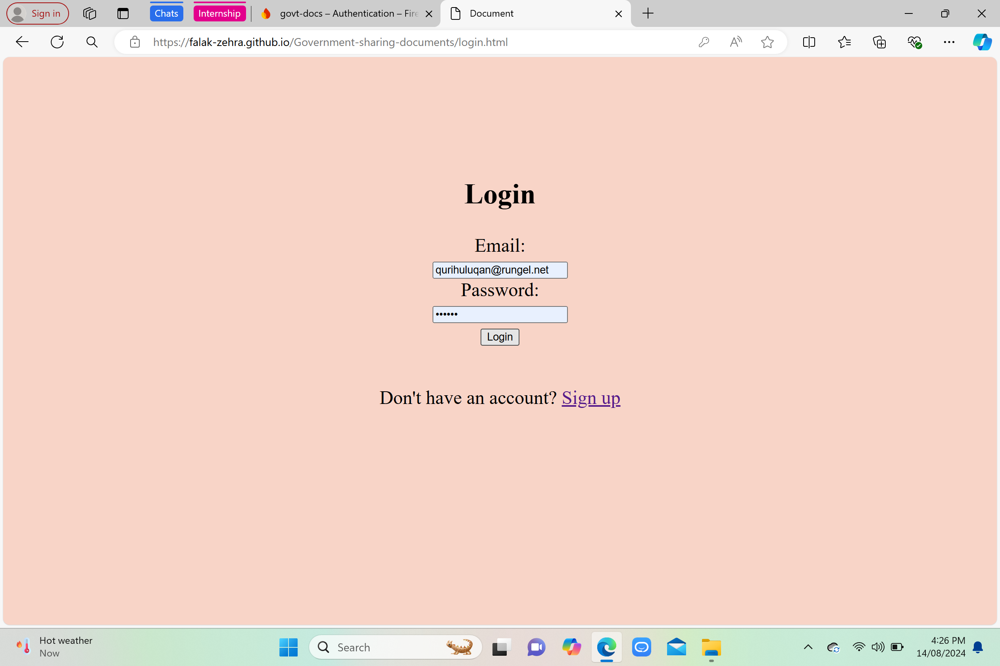
Upload/Update files page -
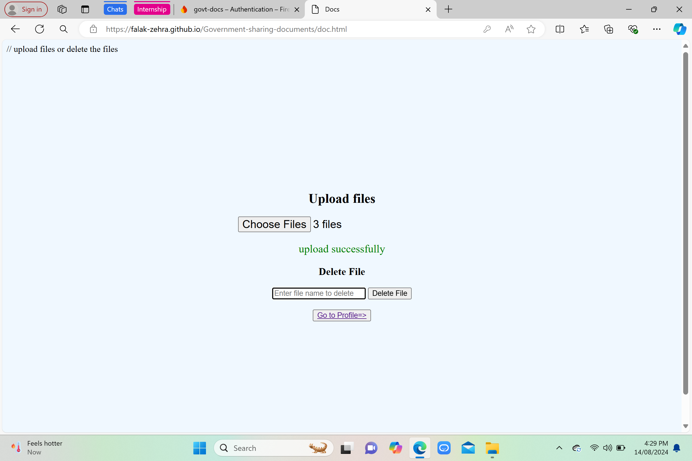
Can Delete File as well-
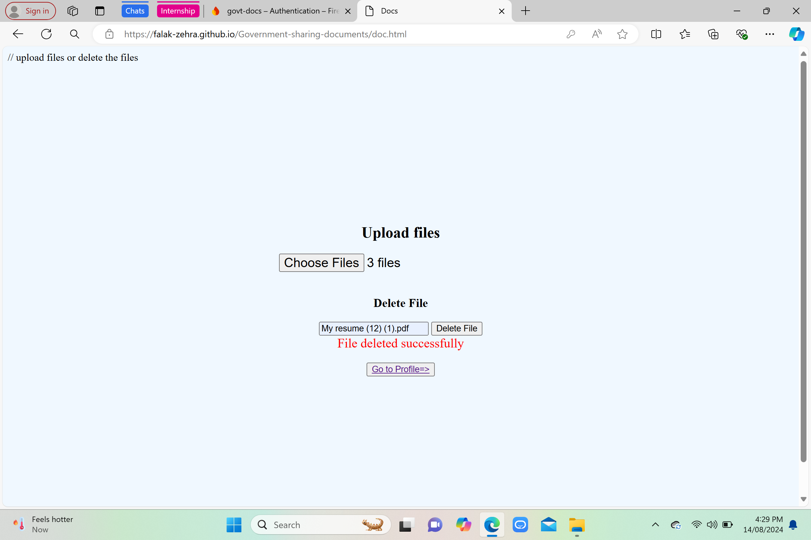
Firebase Storage where uploaded files are stored
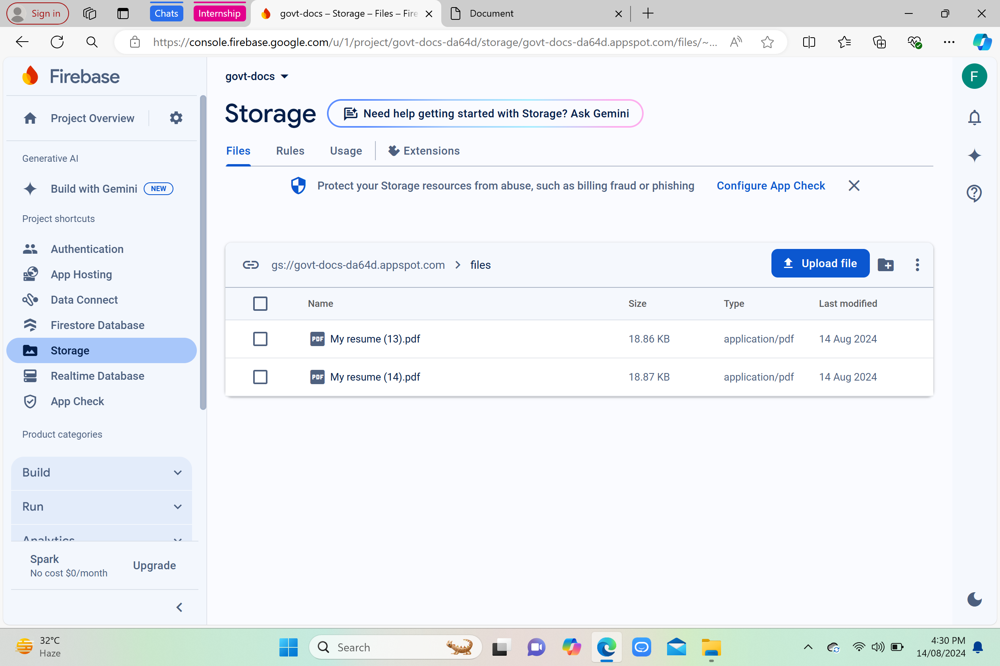
After that Go to MY profile where details of users are inserted
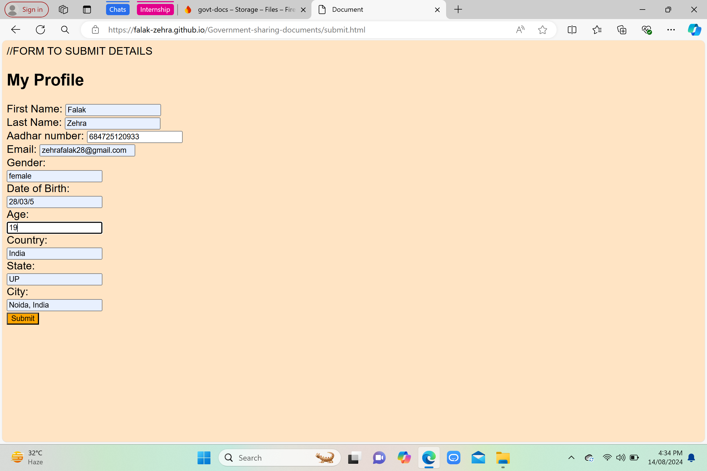
After submitting the form -
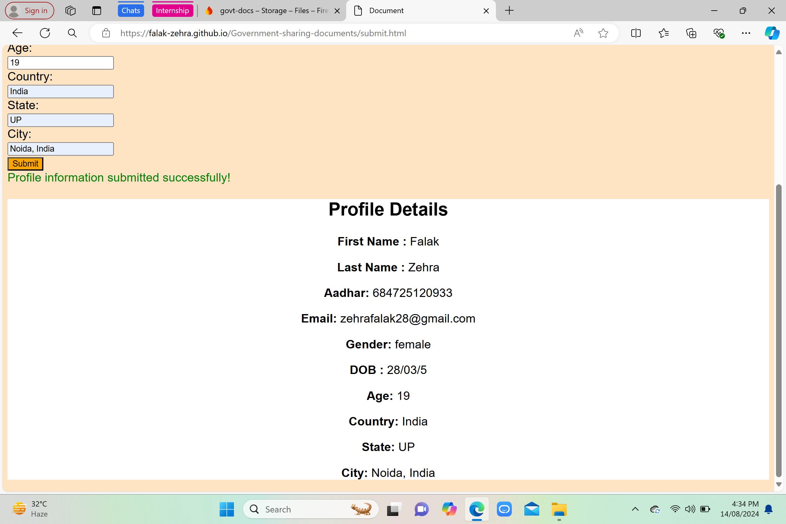
Firebase Cloud Firestore identified as unique Aadhar number
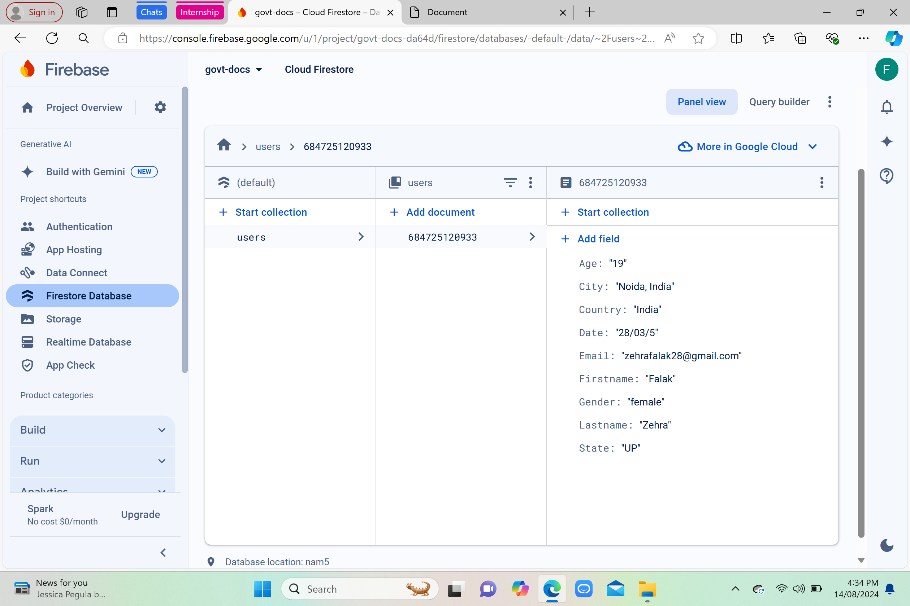

